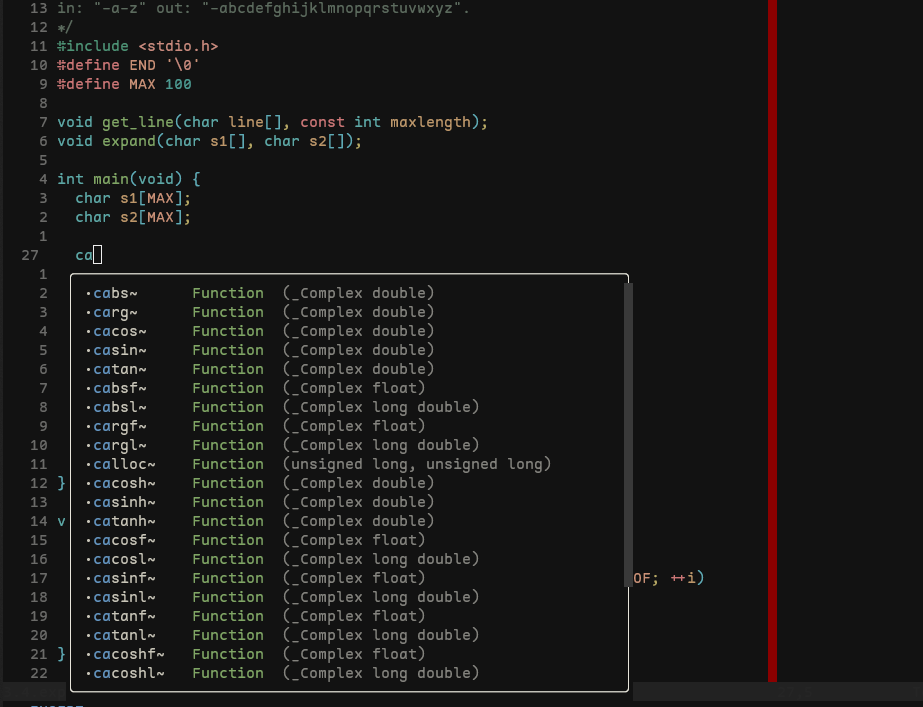

# strangedevel - nvim

This config is based on the config from @ThePrimeagen

## Requirements
- ripgrep
- clang: lsp/formatter/linter for c/cpp
- ruff: lsp/formatter/linter for py
- tsserver: lsp for js/ts

## Plugins

- **package-manager**: [lazy.nvim](https://github.com/folke/lazy.nvim)
- **code-complition**: [copilot](https://github.com/github/copilot.vim)
- **competitive-programming**: [competitest](https://github.com/xeluxee/competitest.nvim)
- **syntax-highlighting**: [treesitter](https://github.com/nvim-treesitter/nvim-treesitter)
- **git**: [vim-fugitive](https://github.com/tpope/vim-fugitive.vim)
- **fzf**: [telescope](https://github.com/nvim-telescope/telescope.nvim)
- **color-scheme**: [vitesse](https://github.com/2nthony/vitesse.nvim)
- **undo-tree**: [undotree](https://github.com/mbbill/undotree.nvim)
- **lsp**:
    - **lsp-manager**: [mason](https://github.com/williamboman/mason.nvim')
    - **lsp-config**: [mason-lspconfig](https://github.com/williamboman/mason-lspconfig.nvim')
    - **lsp-config**: [nvim-lspconfig](https://github.com/neovim/nvim-lspconfig')
    - **ls-server**: [lsp-zero](https://github.com/VonHeikemen/lsp-zero.nvim)
    - **cmp**: [cmp]
        - [cmp-nvim-lps](https://github.com/hrsh7th/cmp-nvim-lsp)
        - [nvim-cmp](https://github.com/hrsh7th/nvim-cmp)
        - [luasnip](https://github.com/L3MON4D3/LuaSnip)
    - **debugging**
        - [nvim-dap](https://github.com/mfussenegger/nvim-dap)
        - [nvim-dap-ui](https://github.com/rcarriga/nvim-dap-ui)
        - [nvim-dap-ui](https://github.com/rcarriga/nvim-dap-ui)
        - [mason-nvim-dap](https://github.com/jay-babu/mason-nvim-dap.nvim)
    - **linters**
        - [nvim-lint](https://github.com/mfussenegger/nvim-lint)
    - **formatters**
        - [nvim-lint](https://github.com/mhartington/formatter.nvim)
